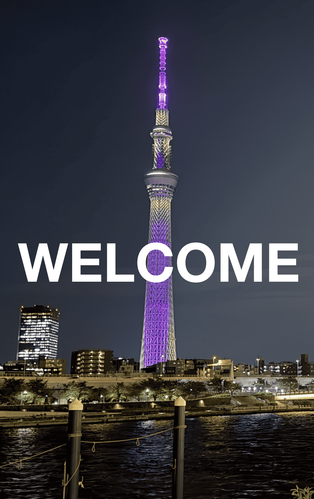
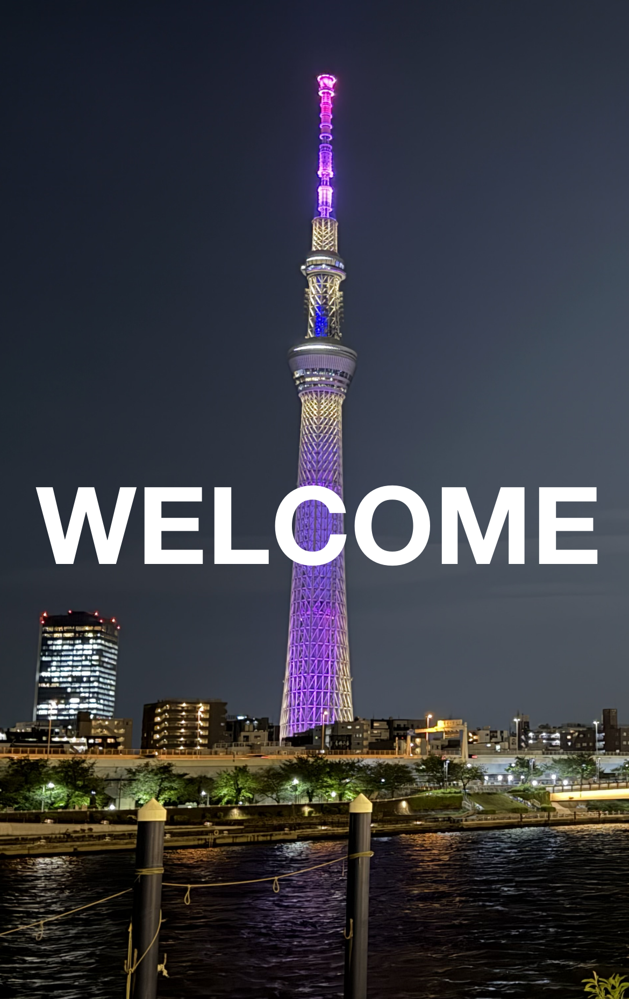
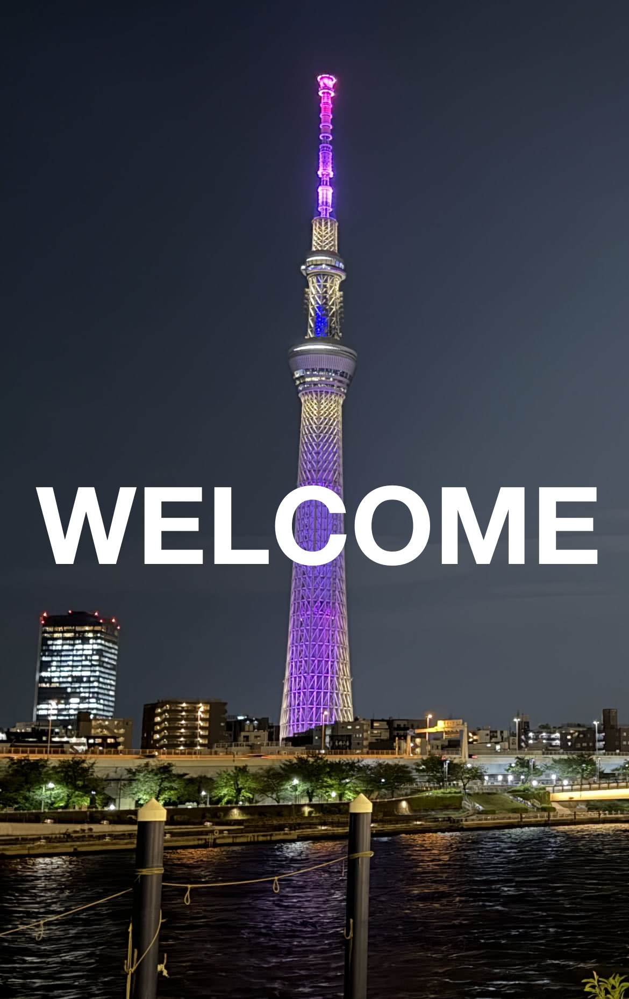
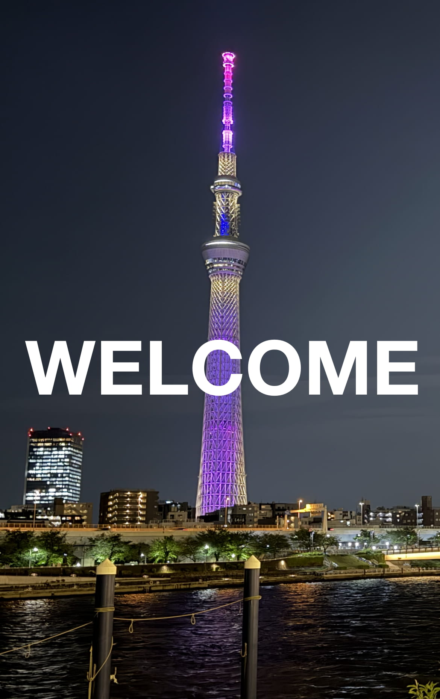
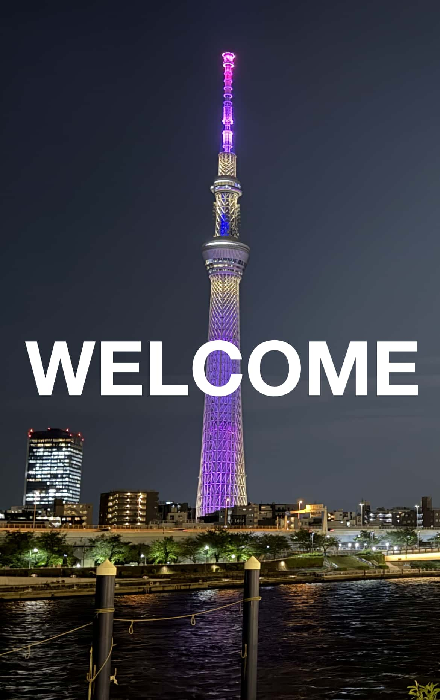

# 画像の圧縮テスト結果

iOSアプリのウォークスルー画面で使用する写真画像のファイルサイズ削減を目的として、各種ツールで圧縮した結果をまとめる。

## ソース

元画像：1.5MB の PNG。写真の上に白字でテキストが入ったデザイン。


## Android Studio の WebP 変換

Android Studio の WebP 変換機能を使って変換した結果。  
テキスト周辺に若干のノイズはあるが許容範囲内と判断し、これを品質の基準とする。

| source | encoded | サイズ |
|:----|:----|:----|
|  |  | 104 KB |

## pngquant（非可逆圧縮）

色数を削減することで圧縮する非可逆圧縮ツール。品質オプション `--quality=60-80` で変換。

```bash
pngquant --quality=60-80 --output output_pngquant_60.png source.png
```

| source | encoded | サイズ |
|:----|:----|:----|
|  |  | 454 KB |

## oxipng（ロスレス圧縮）

PNG のメタデータや圧縮アルゴリズムを最適化するロスレス圧縮ツール。品質は完全に維持される。

```bash
oxipng -o max --out output_oxipng.png source.png
```

| source | encoded | サイズ |
|:----|:----|:----|
|  |  | 1.3 MB |

## pngquant → oxipng の組み合わせ

pngquant で色数を削減したあと、oxipng でさらにロスレス最適化する2段階処理。

```bash
pngquant --quality=60-80 --output tmp.png source.png
oxipng -o max --out output_combined.png tmp.png
```

| source | encoded | サイズ |
|:----|:----|:----|
|  |  | 413 KB |

## Guetzli

Google製の高品質JPEGエンコーダー。最低品質が84に固定されており、それ以下には設定できない。処理に数分かかる場合がある。

```bash
guetzli --quality 84 source.png output_guetzli.jpg
```

| source | encoded | サイズ |
|:----|:----|:----|
|  |  | 187 KB |

## mozjpeg

Mozilla製の高効率JPEGエンコーダー。品質を下げるほどファイルサイズは小さくなるが、
テキスト周辺のノイズが増える。

```bash
# quality 80
/opt/homebrew/opt/mozjpeg/bin/cjpeg -quality 80 -outfile output_mozjpeg_80.jpg source.png

# quality 60
/opt/homebrew/opt/mozjpeg/bin/cjpeg -quality 60 -outfile output_mozjpeg_60.jpg source.png
```

| source | encoded | サイズ |
|:----|:----|:----|
|  |  | 177 KB |
|  |  | 108 KB |
